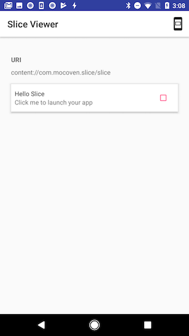

# Your Slice

`Your Slice` is an Android app, simply a taste of Slice in Android-P.

## What is Slice
It is a feature will come soon (today is 2018-6-13) in Google Search app and Google Assistant. It provides us easy ways to use functionalities in apps, e.g. showing a product you are selling, showing the weather forecast of Sydney.

## How to see Slice by yourself

### install Slice Viewer

Download [here](./slice-viewer.apk)

And then install in your device

        $adb install -r -t slice-viewer.apk

### install `Your Slice app` in your device

### run command line

        $adb shell am start -a android.intent.action.VIEW -d slice-content://com.mocoven.slice/slice

## What's Next

### Showing Slice in Google Search

I have not made it successful yet. [Refer](https://www.youtube.com/watch?v=a7IVH5aNwwc)

Notes: `androidx.slice:slice-core:1.0.0-alpha1` and `androidx.slice:slice-core:1.0.0-alpha3` are so different.